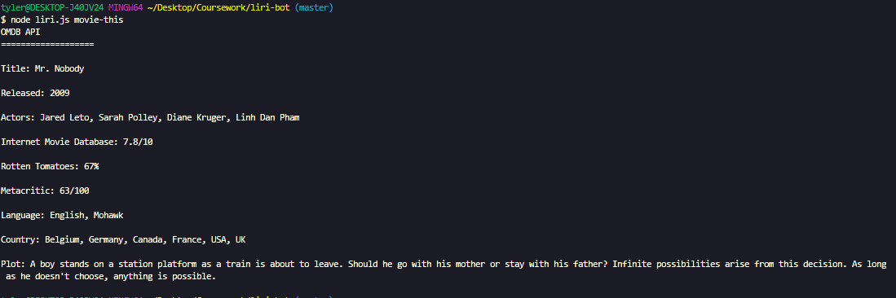

# LIRI-BOT

## your very own LIRI! 

*Liri Bot* is a node.js command line application that you can use to:
- **Find a concert!**
- **Find any song, artist, or album!**
- **Search for any movie** 
### Spotify-this-song
##### Search a song via the "spotify-this-song <your song here>" command

### Movie-this
##### Find a movie via the "movie-this <movie title here>" command

### Concert-this 
##### Find any concert via the "concert-this <artist name here>" command

### Do-what-it-says
##### Application reads the .txt file and issues the command found on the file. 
###### (In this case it's "Spotify-this-song" and the song "I Want it That Way")

====================================================================================================

*Just in case* a command is mis-typed, or forgotten I built in a catch to assist users in their queries 

**As well as a few more fail-safes!**

##### If nothing is entered into the "movie-this" command, I've defaulted the search to find the movie "Mr. Nobody"

##### Lastly, if the artist you search for is not currently touring, I've logged a simple message stating so. 
